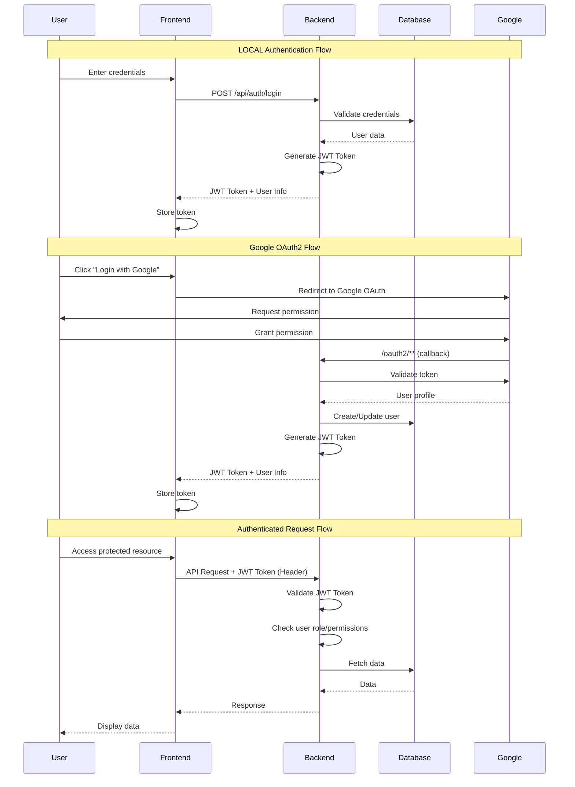
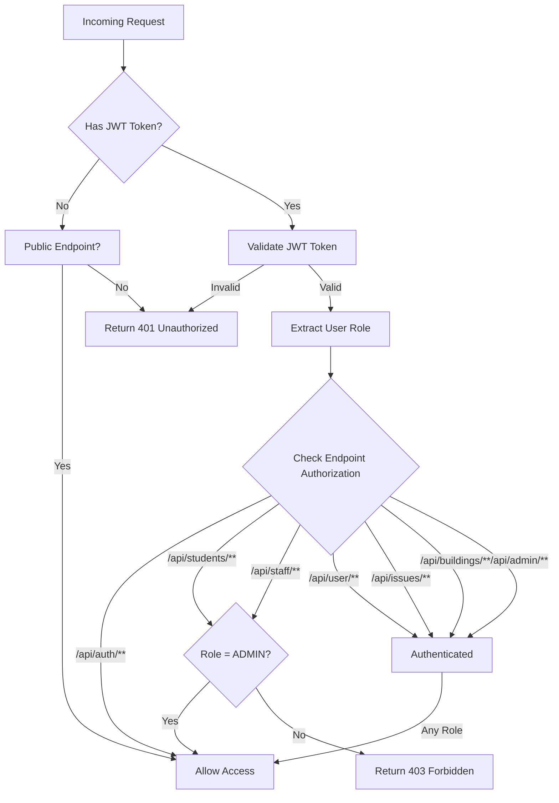

# 📚 API Endpoints Summary

This document provides a comprehensive overview of all API endpoints in the School Maintenance Reporting and Management System (SMRMS).

## 🔐 Authentication & Authorization

The system uses **JWT (JSON Web Token)** authentication for local users and **Google OAuth 2.0** for social login.

### 📊 Authentication Flow Diagram



### 🔑 Authorization Logic



### 🎭 Authorization Roles:
- **STUDENT**: Can report and manage issues, view buildings, and update their own profile
- **MAINTENANCE_STAFF**: Can view and update issues, view buildings and dashboard statistics
- **ADMIN**: Full access to all endpoints including student and staff management

### 🔒 Security Implementation

```
┌─────────────────────────────────────────────────────────────┐
│                    Security Architecture                     │
├─────────────────────────────────────────────────────────────┤
│                                                              │
│  1. JWT Token Generation (Login)                            │
│     ┌──────────────────────────────────────┐               │
│     │ User Credentials                      │               │
│     │  ↓                                    │               │
│     │ BCrypt Password Verification          │               │
│     │  ↓                                    │               │
│     │ JWT Token Creation                    │               │
│     │  - Algorithm: HS256                   │               │
│     │  - Contains: email, roles, expiry     │               │
│     │  ↓                                    │               │
│     │ Return Token to Client                │               │
│     └──────────────────────────────────────┘               │
│                                                              │
│  2. Request Authentication                                   │
│     ┌──────────────────────────────────────┐               │
│     │ Authorization: Bearer <JWT>           │               │
│     │  ↓                                    │               │
│     │ JwtAuthenticationFilter               │               │
│     │  ↓                                    │               │
│     │ Token Validation & User Extraction    │               │
│     │  ↓                                    │               │
│     │ Set SecurityContext                   │               │
│     │  ↓                                    │               │
│     │ Proceed to Controller                 │               │
│     └──────────────────────────────────────┘               │
│                                                              │
│  3. Authorization Check                                      │
│     ┌──────────────────────────────────────┐               │
│     │ @PreAuthorize("hasRole('ADMIN')")    │               │
│     │        OR                             │               │
│     │ SecurityConfig rules                  │               │
│     │  ↓                                    │               │
│     │ Role-based Access Control             │               │
│     │  ↓                                    │               │
│     │ Allow/Deny Access                     │               │
│     └──────────────────────────────────────┘               │
│                                                              │
└─────────────────────────────────────────────────────────────┘
```

---

## 1️⃣ Authentication

| Module         | Method | Endpoint            | Description                    | Authorization |
|----------------|--------|---------------------|--------------------------------|---------------|
| Authentication | POST   | `/api/auth/register` | Register a new user (LOCAL)    | None          |
| Authentication | POST   | `/api/auth/login`    | Login with email and password  | None          |
| OAuth2         | GET    | `/oauth2/**`         | Google OAuth2 login flow       | None          |

**Request Body Examples:**

**Register:**
```json
{
  "fullname": "John Doe",
  "email": "john.doe@example.com",
  "password": "securePassword123",
  "mobileNumber": "+1234567890"
}
```

**Login:**
```json
{
  "email": "john.doe@example.com",
  "password": "securePassword123"
}
```

**Response (Login):**
```json
{
  "token": "eyJhbGciOiJIUzI1NiIsInR5cCI6IkpXVCJ9...",
  "email": "john.doe@example.com",
  "fullname": "John Doe"
}
```

---

## 2️⃣ User Management

| Module | Method | Endpoint                  | Description                        | Authorization      |
|--------|--------|---------------------------|------------------------------------|-------------------|
| User   | GET    | `/api/user/profile`       | Get current logged-in user profile | Authenticated     |
| User   | PUT    | `/api/user/profile`       | Update current user profile        | Authenticated     |
| User   | PUT    | `/api/user/profile/avatar`| Update user avatar (multipart)     | Authenticated     |
| User   | PUT    | `/api/user/update/{email}`| Admin: Update any user by email    | ADMIN only        |

**Request Body Examples:**

**Update Profile:**
```json
{
  "fullname": "John Updated",
  "mobileNumber": "+9876543210",
  "studentDepartment": "Computer Science",
  "studentIdNumber": "2024-001",
  "password": "newPassword123"
}
```

**Update Avatar:**
- Content-Type: `multipart/form-data`
- Form Field: `file` (image file)

---

## 3️⃣ Student Management

| Module  | Method | Endpoint              | Description              | Authorization |
|---------|--------|-----------------------|--------------------------|---------------|
| Student | GET    | `/api/students`       | Get all students         | ADMIN only    |
| Student | GET    | `/api/students/{id}`  | Get student by ID        | ADMIN only    |
| Student | POST   | `/api/students`       | Create new student       | ADMIN only    |
| Student | PUT    | `/api/students/{id}`  | Update student           | ADMIN only    |
| Student | DELETE | `/api/students/{id}`  | Delete student           | ADMIN only    |

**Request Body Examples:**

**Create Student:**
```json
{
  "fullname": "Jane Smith",
  "email": "jane.smith@student.edu",
  "mobileNumber": "+1122334455",
  "password": "studentPassword123",
  "studentDepartment": "Engineering",
  "studentIdNumber": "2024-002"
}
```

**Update Student:**
```json
{
  "studentDepartment": "Computer Engineering",
  "studentIdNumber": "2024-002-UPDATED"
}
```

---

## 4️⃣ Maintenance Staff Management

| Module            | Method | Endpoint           | Description                    | Authorization          |
|-------------------|--------|--------------------|--------------------------------|------------------------|
| Maintenance Staff | GET    | `/api/staff`       | Get all maintenance staff      | ADMIN only             |
| Maintenance Staff | GET    | `/api/staff/{id}`  | Get maintenance staff by ID    | ADMIN only             |
| Maintenance Staff | POST   | `/api/staff`       | Create new maintenance staff   | ADMIN only             |
| Maintenance Staff | PUT    | `/api/staff/{id}`  | Update maintenance staff       | ADMIN only             |
| Maintenance Staff | DELETE | `/api/staff/{id}`  | Delete maintenance staff       | ADMIN only             |

**Request Body Examples:**

**Create Maintenance Staff:**
```json
{
  "fullname": "Mike Johnson",
  "email": "mike.johnson@maintenance.edu",
  "mobileNumber": "+5566778899",
  "password": "staffPassword123",
  "staffId": "STAFF-001"
}
```

**Update Maintenance Staff:**
```json
{
  "fullname": "Mike Johnson Updated",
  "mobileNumber": "+9988776655",
  "staffId": "STAFF-001-NEW",
  "password": "newPassword456"
}
```

---

## 5️⃣ Issue Management

| Module | Method | Endpoint                  | Description                     | Authorization            |
|--------|--------|---------------------------|---------------------------------|--------------------------|
| Issue  | POST   | `/api/issues`             | Create new issue (multipart)    | Authenticated (any role) |
| Issue  | GET    | `/api/issues`             | Get all issues                  | Authenticated (any role) |
| Issue  | GET    | `/api/issues/{id}`        | Get issue by ID                 | Authenticated (any role) |
| Issue  | GET    | `/api/issues/building/{id}`| Get issues by building ID       | Authenticated (any role) |
| Issue  | PUT    | `/api/issues/{id}`        | Update issue (multipart)        | Authenticated (any role) |
| Issue  | DELETE | `/api/issues/{id}`        | Delete issue                    | Authenticated (any role) |

**Request Format:**
- Content-Type: `multipart/form-data`
- Parts:
  - `data`: JSON object with issue details
  - `photo` (optional): Image file
  - `file` (optional): Additional file attachment

**Create Issue Data Example:**
```json
{
  "buildingId": "building-uuid",
  "location": "Room 301",
  "category": "ELECTRICAL",
  "priority": "HIGH",
  "description": "Broken light fixture in classroom",
  "status": "PENDING"
}
```

**Update Issue Data Example:**
```json
{
  "location": "Room 301 - Updated",
  "category": "ELECTRICAL",
  "priority": "CRITICAL",
  "description": "Updated description",
  "status": "IN_PROGRESS",
  "resolvedById": "user-uuid"
}
```

---

## 6️⃣ Building Management

| Module   | Method | Endpoint                     | Description                          | Authorization |
|----------|--------|------------------------------|--------------------------------------|---------------|
| Building | POST   | `/api/buildings`             | Create new building (multipart)      | Authenticated |
| Building | GET    | `/api/buildings`             | Get all buildings with issue count   | Authenticated |
| Building | GET    | `/api/buildings/active`      | Get all active buildings             | Authenticated |
| Building | GET    | `/api/buildings/code/{code}` | Get building by building code        | Authenticated |
| Building | PUT    | `/api/buildings/{id}`        | Update building (multipart)          | Authenticated |
| Building | DELETE | `/api/buildings/{id}`        | Delete building                      | Authenticated |

**Request Format:**
- Content-Type: `multipart/form-data`
- Parameters:
  - `buildingCode`: String
  - `buildingName`: String
  - `file` (optional): Building image

**Create Building Example:**
```
buildingCode: "BLDG-A"
buildingName: "Main Academic Building"
file: [image file]
```

---

## 7️⃣ Admin Dashboard & Statistics

| Module | Method | Endpoint                        | Description                      | Authorization            |
|--------|--------|---------------------------------|----------------------------------|--------------------------|
| Admin  | GET    | `/api/admin/dashboard`          | Get dashboard statistics         | Authenticated (any role) |
| Admin  | GET    | `/api/admin/stats/monthly-issues`| Get monthly issues data          | Authenticated (any role) |

**Dashboard Response Example:**
```json
{
  "totalIssues": 150,
  "pendingIssues": 45,
  "inProgressIssues": 30,
  "resolvedIssues": 75,
  "issuesByCategory": [
    { "category": "ELECTRICAL", "count": 50 },
    { "category": "PLUMBING", "count": 40 }
  ],
  "issuesByBuilding": [
    { "buildingName": "Main Building", "count": 60 }
  ]
}
```

**Monthly Issues Response Example:**
```json
[
  {
    "month": "2024-10",
    "issueCount": 25
  },
  {
    "month": "2024-11",
    "issueCount": 30
  }
]
```

---

## 🔒 Authorization Summary

### Public Endpoints (No Authentication Required):
- `/api/auth/register`
- `/api/auth/login`
- `/oauth2/**`

### Authenticated Endpoints (Any logged-in user):
- `/api/user/**`
- `/api/issues/**`
- `/api/buildings/**`
- `/api/admin/**`

### Role-Specific Endpoints:

**ADMIN Only:**
- `/api/students/**` (Student management)
- `/api/staff/**` (Maintenance staff management)

---

## 🛡️ Security Notes

1. **JWT Token**: Include in `Authorization` header as `Bearer <token>`
2. **CORS**: Configured for `http://localhost:5173` (React frontend) in development. Update CORS configuration for production deployment.
3. **Session Management**: Stateless (JWT-based)
4. **Password Encoding**: BCrypt encryption
5. **File Uploads**: Stored in Supabase Storage Buckets

---

## 📝 Common HTTP Status Codes

| Code | Description                          |
|------|--------------------------------------|
| 200  | OK - Request successful              |
| 201  | Created - Resource created           |
| 400  | Bad Request - Invalid input          |
| 401  | Unauthorized - Authentication failed |
| 403  | Forbidden - Insufficient permissions |
| 404  | Not Found - Resource doesn't exist   |
| 413  | Payload Too Large - File too big     |
| 500  | Internal Server Error                |

---

## 🚀 Base URL

**Development:** `http://localhost:8080`
**Production:** Deployed on Railway (URL varies)

---

*Last Updated: December 2024*
*Version: 1.0*
